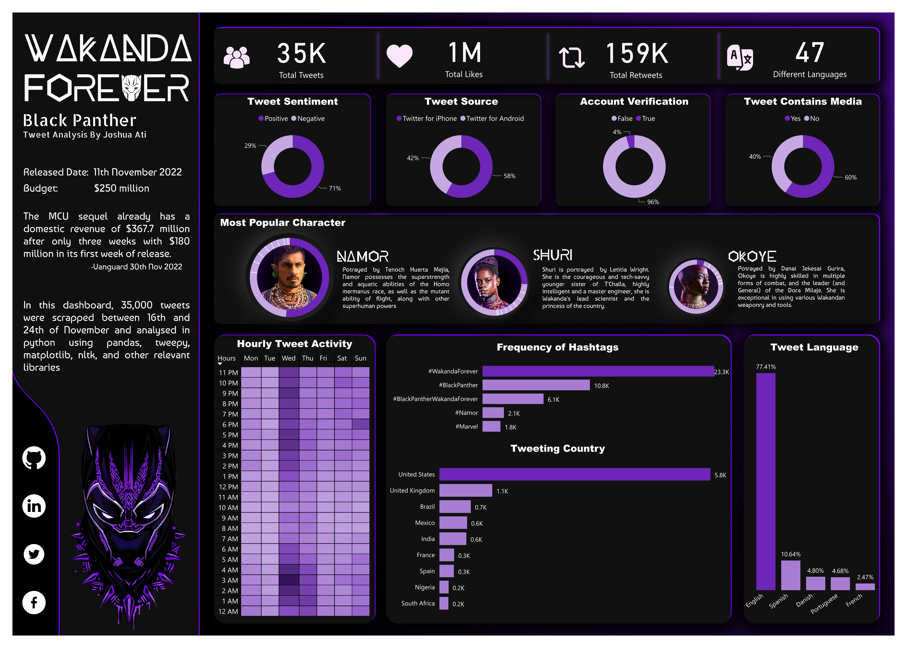

# Twitter Analysis of Black Panther:Wakanda Forever
## By Joshua Ati

## Goals
The main aim of this project was to scrape tweets relating to black panther's sequel, wakanda forever. 33,000 tweets were gotten between 16th and 24th of November 2022. The tweets were then cleaned, Sentimental Analysis was performed using Python's Natural Language Toolkit(NLTK) library. 

### Python installs
`$ pip install tweepy`
`$ pip install langdetect`

### Report

---
### References
- List of language names as their ISO 639-1 codes gotten from: https://datahub.io/core/language-codes#readme
- Convert from pdf to image: https://tools.pdf24.org
- Icons were gotten from: https://www.flaticon.com/
- 